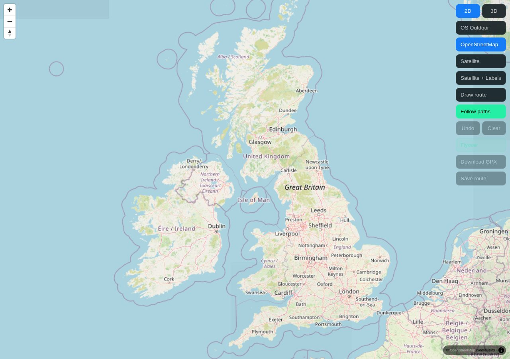
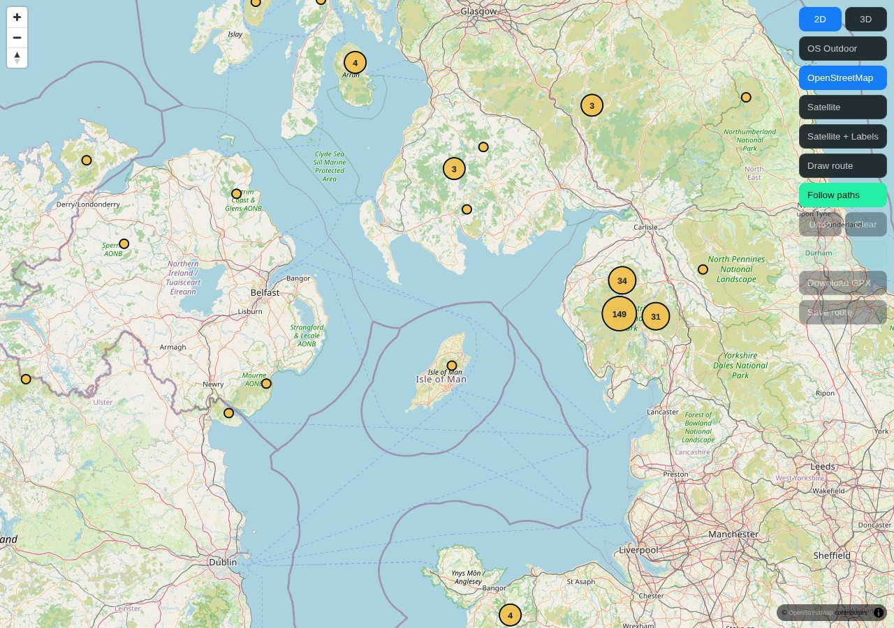
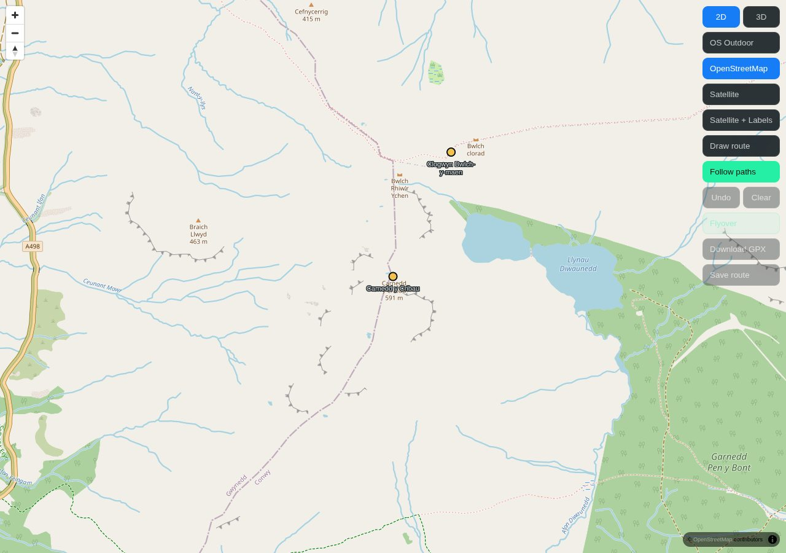
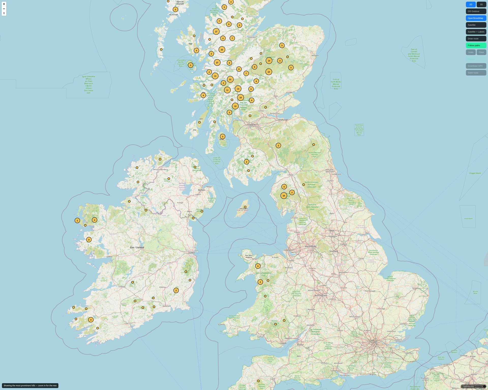
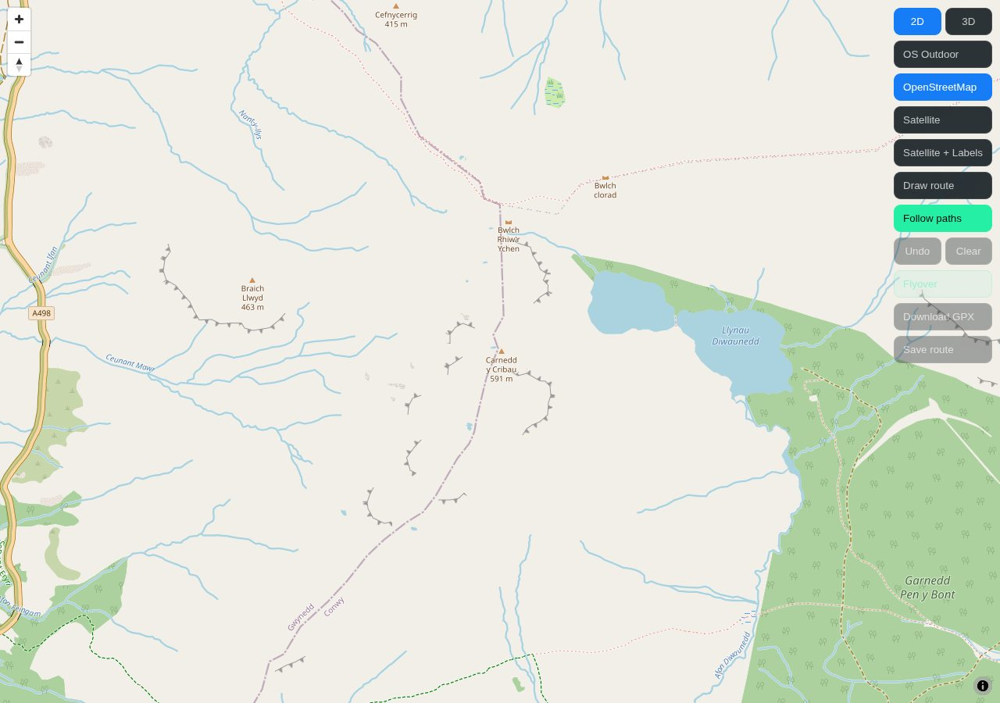

# Summit clustering — live browser verification

Checked 2026-10-05. Imported author commits `b7d5b8b`, `4d0e877` and `d381a85`
from `origin/claude/route-map-server`. No local fixes to the summit query, pin
logic, clustering settings or page behaviour.

**Overall: not a full pass. The delayed-response race is reproducible.**
Whole-country visibility and reuse of the server's pan margin also fall short
of the requested behaviour.

## Integration safeguards

The route-map page changed only to wire the summit module and notice UI.
The existing globe, terrain, pitch and OS configuration were preserved.
Imported summit modules/tests match the shared branch byte-for-byte.
The query and endpoint are unchanged. Offline download remains disabled.
Eight targeted test files passed: **156 tests**. The API built and restarted.

## Browser method

Actual route: `http://localhost:8080/api/route-map`, Chromium 152 with working
software WebGL, driven using DevTools Protocol. Real server/API data was used.
The delayed response was held and released unchanged; no summit payloads
were fabricated and no database or application changes were made for testing.

The initial managed browser failed with `Failed to initialize WebGL`,
`GL_VENDOR = Disabled`, `GL_RENDERER = Disabled` and
`BindToCurrentSequence failed`. A separate Chromium launch overcame that
runner limitation and enabled the real interaction checks below.

## 1. Britain and cluster expansion — partial pass

At **1280×900**, fitting all Britain reached **zoom 5.2515**, with bounds
`-16.3125,49.6667,7.3125,59.2651`. The basemap rendered, but there were **no
amber summit clusters**. The module deliberately clears pins below zoom 7.
Thus the requested whole-Britain appearance does not occur in this normal
desktop viewport.

Separately, at zoom 7 there were **seven visible numbered amber clusters**,
but Britain no longer fitted entirely. Clicking a cluster containing **31**
summits expanded zoom **7 → 9**. The resulting view had **28 clusters and
five individual points**. Cluster rendering and expansion work.




## 2. Snowdonia and selection — pass

At zoom 14, two individual amber summit markers and two summit labels were
visible in the particular viewport. Clicking Clogwyn Bwlch-y-maen emitted:

```json
{
  "type": "summitSelected",
  "id": "2e7fd733-78e0-4735-bbfc-7bde36577048",
  "name": "Clogwyn Bwlch-y-maen",
  "alternativeName": null,
  "heightM": 548,
  "classification": null,
  "place": "Conwy, Wales",
  "lat": 53.069283401329955,
  "lng": -3.9729872345924377
}
```

Identity, name and height matched the real endpoint record. Coordinates
differed only by the small GeoJSON/rendering precision adjustment.



## 3. Truncation notice — pass

The ordinary desktop zoom-7 request returned **241** records, untruncated.
A **3000×2400 diagnostic viewport** requested
`bbox=-12.73975,50.49033,3.73975,58.15155&zoom=7` and returned **400** with
`truncated:true`. The bottom-left notice appeared exactly as:

> Showing the most prominent hills — zoom in for the rest

Returning to untruncated zoom-14 Snowdonia cleared the text and hid the notice.



## 4. Dragging and request reuse — debounce passes, margin reuse does not

A continuous mouse drag lasting **5.035 seconds** generated:

- **Zero** summit requests during the drag.
- **One** summit request after release, HTTP 200:
  `bbox=-4.02302,53.05245,-3.96809,53.07566&zoom=14`.
- Repeated stationary `moveend` events: **zero** additional requests.

A subsequent shift of only **0.001°** in each axis nevertheless requested
`bbox=-4.02202,53.05345,-3.96709,53.07666&zoom=14`, HTTP 200.
The preceding response was untruncated; the new visible rectangle is within
its server-side 0.02° latitude padding and larger longitude padding.
Thus this covered-view shift fetched unnecessarily. The browser records the
unpadded request bounds in `summitLoaded`, despite the cache contract describing
the padded area. No correction was made.

## 5. Quick A → B → A with delayed B — FAIL

1. Fully loaded Snowdonia A, zoom 14, center `[-3.977048,53.064063]`.
2. Moved to Ben Nevis B, starting:
   `/api/summits?bbox=-5.03047,56.78642,-4.97553,56.80757&zoom=14`.
3. Held the real B response, returned to A, and then released B after about
   **2.2 seconds**.
4. B completed **HTTP 200**, **16** actual hills, `truncated:false`.
5. Returning to A issued **no new A request**. Generation stayed **13**;
   B was not cancelled.
6. The camera stayed at A, but `summitLoaded` changed to B's rectangle.
   **Zero summit points or clusters remained visible at A.**

Final camera bounds:
`-4.004513820312496,53.05245649425521,-3.9495821796874395,53.075666379236054`.

Final loaded bounds:
`-5.030465820313168,56.786423173656004,-4.97553417968814,56.80757384381326`.

The covered-A early return occurs before invalidating the pending B generation.
Consequently the delayed B response is still accepted. This diagnosis is from
the real browser evidence plus the untouched author implementation; no fix
was made.



## Bounded network evidence

All listed summit responses completed HTTP 200; none were marked cancelled.
Times are the local browser observer's response measurements, not production
latency guarantees. The initial observer's zero-ms value is not a reliable
latency measurement.

| Phase | bbox | Zoom | Records | Truncated | Response ms |
|---|---|---:|---:|---|---:|
| Initial | -4.05253,53.09171,-3.94267,53.13808 | 13 | 25 | false | 0 |
| Clusters | -8.01563,53.03920,-0.98438,55.91039 | 7 | 241 | false | 64 |
| Cluster expansion | -3.73638,54.12925,-1.97857,54.84716 | 9 | 80 | false | 4 |
| Snowdonia | -4.00451,53.05246,-3.94958,53.07567 | 14 | 10 | false | 5 |
| Desktop notice check | -8.01563,53.03920,-0.98438,55.91039 | 7 | 241 | false | 12 |
| Wide notice check | -12.73975,50.49033,3.73975,58.15155 | 7 | 400 | true | 6 |
| Wide view repeated | -12.73975,50.49033,3.73975,58.15155 | 7 | 400 | true | 12 |
| Back to desktop | -8.01563,53.03920,-0.98438,55.91039 | 7 | 241 | false | 19 |
| Notice cleared | -4.00451,53.05246,-3.94958,53.07567 | 14 | 10 | false | 2 |
| Drag released | -4.02302,53.05245,-3.96809,53.07566 | 14 | 13 | false | 41 |
| Small covered shift | -4.02202,53.05345,-3.96709,53.07666 | 14 | 14 | false | 8 |
| A loaded before race | -4.00451,53.05246,-3.94958,53.07567 | 14 | 10 | false | 14 |
| Delayed B | -5.03047,56.78642,-4.97553,56.80757 | 14 | 16 | false | **2211** |
| After race diagnostics | -4.00451,53.05246,-3.94958,53.07567 | 14 | 10 | false | 2 |
| Local 3D | -4.04203,53.04935,-3.91206,53.11894 | 14 | 37 | false | 229 |
| Terrain boundary | -4.35233,52.98087,-3.60176,53.38055 | 12 | 258 | false | 355 |
| Restored local | -4.04203,53.04935,-3.91206,53.11894 | 14 | 37 | false | 5 |

## Protected map behaviour and console

- Local 3D zoom 14: **globe**, approximately **60° pitch**, terrain on.
- Zoom 11.5: terrain off.
- World zoom 5: **globe**, **pitch 0**, terrain off.
- Back to local zoom 14: pitch and terrain restored.
- OS/OSM/satellite definitions remained present and unchanged.
- OS tile requests from this **localhost browser origin** failed CORS, with
  `No 'Access-Control-Allow-Origin' header is present`. The existing fallback
  selected OSM. OS rendering therefore remains **unverified**; this is not
  proof of failure on the published host.
- Other console output: favicon 404; shared hillshade/terrain-source warning;
  GPU readback performance warnings.
- **No missing-glyph errors or uncaught page exceptions.**

The race did not produce a console exception: it silently accepted the wrong
area's answer. No summit logic or clustering settings were changed to correct it.
